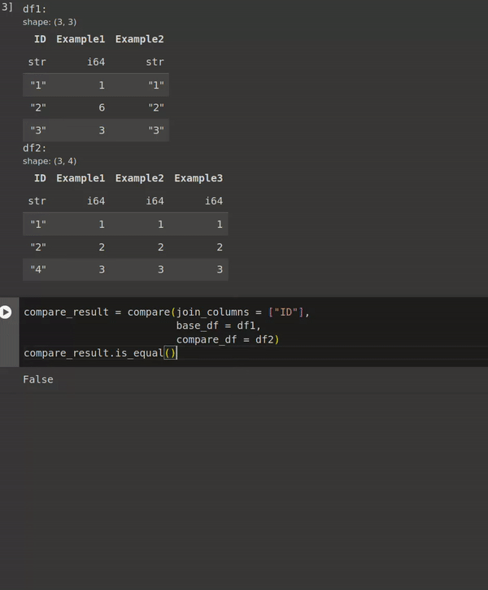

# pl_compare: Compare and find the differences between two Polars DataFrames. 

[Github](https://github.com/concur1/pl_compare) - [PyPi Page](https://pypi.org/project/pl-compare/)

**You will find pl-compare useful if you find yourself writing various SQL/Dataframe operations to**:
- Understand how well two tables Reconcile [example](#Full-report)
- Find the schema differences between two tables [example](#Schema-differences-summary-and-details)
- Find counts or examples of rows that exist in one table but not another [example](#Row-differences-summary-and-details)
- Find counts or examples of value differences between two tables [example](#Value-differences-summary-and-details)
- Assert that two tables are exactly equal (such as for an automated test) [example](#Assert-two-frames-are-equal-for-a-test)
- Assert that two tables have matching schemas, rows or column values [example](#Return-booleans-to-check-for-schema-row-and-value-differences)

[Click for a jupyter notebook with example usage](https://github.com/concur1/pl_compare/blob/main/pl_compare_demo.ipynb)



**With pl-compare you can**:
- Get statistical summaries and/or examples and/or a boolean to indicate:
  - Schema differences
  - Row differences
  - Value differences
- Easily works for Pandas dataframes and other tabular data formats with conversion using Apache arrow 
- View differences as a text report
- Get differences as a Polars LazyFrame or DataFrame
- Use LazyFrames for larger than memory comparisons
- Specify the equality calculation that is used to dermine value differences


## Installation

```zsh
pip install pl_compare
```

## Examples (click to expand)

### Return booleans to check for schema, row and value differences 


```python
>>> import polars as pl
>>> from pl_compare import compare
>>>
>>> base_df = pl.DataFrame(
...     {
...         "ID": ["123456", "1234567", "12345678"],
...         "Example1": [1, 6, 3],
...         "Example2": ["1", "2", "3"],
...     }
... )
>>> compare_df = pl.DataFrame(
...     {
...         "ID": ["123456", "1234567", "1234567810"],
...         "Example1": [1, 2, 3],
...         "Example2": [1, 2, 3],
...         "Example3": [1, 2, 3],
...     },
... )
>>>
>>> compare_result = compare(["ID"], base_df, compare_df)
>>> print("is_schemas_equal:", compare_result.is_schemas_equal())
is_schemas_equal: False
>>> print("is_rows_equal:", compare_result.is_rows_equal())
is_rows_equal: False
>>> print("is_values_equal:", compare_result.is_values_equal())
is_values_equal: False
>>>
```


### Schema differences summary and details 


```python
>>> import polars as pl
>>> from pl_compare import compare
>>>
>>> base_df = pl.DataFrame(
...     {
...         "ID": ["123456", "1234567", "12345678"],
...         "Example1": [1, 6, 3],
...         "Example2": ["1", "2", "3"],
...     }
... )
>>> compare_df = pl.DataFrame(
...     {
...         "ID": ["123456", "1234567", "1234567810"],
...         "Example1": [1, 2, 3],
...         "Example2": [1, 2, 3],
...         "Example3": [1, 2, 3],
...     },
... )
>>>
>>> compare_result = compare(["ID"], base_df, compare_df)
>>> print("schemas_summary()")
schemas_summary()
>>> print(compare_result.schemas_summary())
shape: (6, 2)
┌─────────────────────────────────┬───────┐
│ Statistic                       ┆ Count │
│ ---                             ┆ ---   │
│ str                             ┆ i64   │
╞═════════════════════════════════╪═══════╡
│ Columns in base                 ┆ 3     │
│ Columns in compare              ┆ 4     │
│ Columns in base and compare     ┆ 3     │
│ Columns only in base            ┆ 0     │
│ Columns only in compare         ┆ 1     │
│ Columns with schema difference... ┆ 1     │
└─────────────────────────────────┴───────┘
>>> print("schemas_sample()")
schemas_sample()
>>> print(compare_result.schemas_sample())
shape: (2, 3)
┌──────────┬─────────────┬────────────────┐
│ column   ┆ base_format ┆ compare_format │
│ ---      ┆ ---         ┆ ---            │
│ str      ┆ str         ┆ str            │
╞══════════╪═════════════╪════════════════╡
│ Example2 ┆ String      ┆ Int64          │
│ Example3 ┆ null        ┆ Int64          │
└──────────┴─────────────┴────────────────┘
>>>
```


### Row differences summary and details 


```python
>>> import polars as pl
>>> from pl_compare import compare
>>>
>>> base_df = pl.DataFrame(
...     {
...         "ID": ["123456", "1234567", "12345678"],
...         "Example1": [1, 6, 3],
...         "Example2": ["1", "2", "3"],
...     }
... )
>>> compare_df = pl.DataFrame(
...     {
...         "ID": ["123456", "1234567", "1234567810"],
...         "Example1": [1, 2, 3],
...         "Example2": [1, 2, 3],
...         "Example3": [1, 2, 3],
...     },
... )
>>>
>>> compare_result = compare(["ID"], base_df, compare_df)
>>> print("rows_summary()")
rows_summary()
>>> print(compare_result.rows_summary())
shape: (5, 2)
┌──────────────────────────┬───────┐
│ Statistic                ┆ Count │
│ ---                      ┆ ---   │
│ str                      ┆ i64   │
╞══════════════════════════╪═══════╡
│ Rows in base             ┆ 3     │
│ Rows in compare          ┆ 3     │
│ Rows only in base        ┆ 1     │
│ Rows only in compare     ┆ 1     │
│ Rows in base and compare ┆ 2     │
└──────────────────────────┴───────┘
>>> print("rows_sample()")
rows_sample()
>>> print(compare_result.rows_sample())
shape: (2, 3)
┌────────────┬──────────┬─────────────────┐
│ ID         ┆ variable ┆ value           │
│ ---        ┆ ---      ┆ ---             │
│ str        ┆ str      ┆ str             │
╞════════════╪══════════╪═════════════════╡
│ 12345678   ┆ status   ┆ in base only    │
│ 1234567810 ┆ status   ┆ in compare only │
└────────────┴──────────┴─────────────────┘
>>>
```


### Value differences summary and details 


```python
>>> import polars as pl
>>> from pl_compare import compare
>>>
>>> base_df = pl.DataFrame(
...     {
...         "ID": ["123456", "1234567", "12345678"],
...         "Example1": [1, 6, 3],
...         "Example2": ["1", "2", "3"],
...     }
... )
>>> compare_df = pl.DataFrame(
...     {
...         "ID": ["123456", "1234567", "1234567810"],
...         "Example1": [1, 2, 3],
...         "Example2": [1, 2, 3],
...         "Example3": [1, 2, 3],
...     },
... )
>>>
>>> compare_result = compare(["ID"], base_df, compare_df)
>>> print("values_summary()")
values_summary()
>>> print(compare_result.values_summary())
shape: (2, 3)
┌─────────────────────────┬───────┬────────────┐
│ Value Differences       ┆ Count ┆ Percentage │
│ ---                     ┆ ---   ┆ ---        │
│ str                     ┆ i64   ┆ f64        │
╞═════════════════════════╪═══════╪════════════╡
│ Total Value Differences ┆ 1     ┆ 50.0       │
│ Example1                ┆ 1     ┆ 50.0       │
└─────────────────────────┴───────┴────────────┘
>>> print("values_sample()")
values_sample()
>>> print(compare_result.values_sample())
shape: (1, 4)
┌─────────┬──────────┬──────┬─────────┐
│ ID      ┆ variable ┆ base ┆ compare │
│ ---     ┆ ---      ┆ ---  ┆ ---     │
│ str     ┆ str      ┆ i64  ┆ i64     │
╞═════════╪══════════╪══════╪═════════╡
│ 1234567 ┆ Example1 ┆ 6    ┆ 2       │
└─────────┴──────────┴──────┴─────────┘
>>>
```


### Full report 

```python
>>> import polars as pl
>>> from pl_compare import compare
>>>
>>> base_df = pl.DataFrame(
...     {
...         "ID": ["123456", "1234567", "12345678"],
...         "Example1": [1, 6, 3],
...         "Example2": ["1", "2", "3"],
...     }
... )
>>> compare_df = pl.DataFrame(
...     {
...         "ID": ["123456", "1234567", "1234567810"],
...         "Example1": [1, 2, 3],
...         "Example2": [1, 2, 3],
...         "Example3": [1, 2, 3],
...     },
... )
>>>
>>> compare_result = compare(["ID"], base_df, compare_df)
>>> compare_result.report()
--------------------------------------------------------------------------------
COMPARISON REPORT
--------------------------------------------------------------------------------
<BLANKLINE>
SCHEMA DIFFERENCES:
shape: (6, 2)
┌─────────────────────────────────┬───────┐
│ Statistic                       ┆ Count │
│ ---                             ┆ ---   │
│ str                             ┆ i64   │
╞═════════════════════════════════╪═══════╡
│ Columns in base                 ┆ 3     │
│ Columns in compare              ┆ 4     │
│ Columns in base and compare     ┆ 3     │
│ Columns only in base            ┆ 0     │
│ Columns only in compare         ┆ 1     │
│ Columns with schema difference... ┆ 1     │
└─────────────────────────────────┴───────┘
shape: (2, 3)
┌──────────┬─────────────┬────────────────┐
│ column   ┆ base_format ┆ compare_format │
│ ---      ┆ ---         ┆ ---            │
│ str      ┆ str         ┆ str            │
╞══════════╪═════════════╪════════════════╡
│ Example2 ┆ String      ┆ Int64          │
│ Example3 ┆ null        ┆ Int64          │
└──────────┴─────────────┴────────────────┘
--------------------------------------------------------------------------------
<BLANKLINE>
ROW DIFFERENCES:
shape: (5, 2)
┌──────────────────────────┬───────┐
│ Statistic                ┆ Count │
│ ---                      ┆ ---   │
│ str                      ┆ i64   │
╞══════════════════════════╪═══════╡
│ Rows in base             ┆ 3     │
│ Rows in compare          ┆ 3     │
│ Rows only in base        ┆ 1     │
│ Rows only in compare     ┆ 1     │
│ Rows in base and compare ┆ 2     │
└──────────────────────────┴───────┘
shape: (2, 3)
┌────────────┬──────────┬─────────────────┐
│ ID         ┆ variable ┆ value           │
│ ---        ┆ ---      ┆ ---             │
│ str        ┆ str      ┆ str             │
╞════════════╪══════════╪═════════════════╡
│ 12345678   ┆ status   ┆ in base only    │
│ 1234567810 ┆ status   ┆ in compare only │
└────────────┴──────────┴─────────────────┘
--------------------------------------------------------------------------------
<BLANKLINE>
VALUE DIFFERENCES:
shape: (2, 3)
┌─────────────────────────┬───────┬────────────┐
│ Value Differences       ┆ Count ┆ Percentage │
│ ---                     ┆ ---   ┆ ---        │
│ str                     ┆ i64   ┆ f64        │
╞═════════════════════════╪═══════╪════════════╡
│ Total Value Differences ┆ 1     ┆ 50.0       │
│ Example1                ┆ 1     ┆ 50.0       │
└─────────────────────────┴───────┴────────────┘
shape: (1, 4)
┌─────────┬──────────┬──────┬─────────┐
│ ID      ┆ variable ┆ base ┆ compare │
│ ---     ┆ ---      ┆ ---  ┆ ---     │
│ str     ┆ str      ┆ i64  ┆ i64     │
╞═════════╪══════════╪══════╪═════════╡
│ 1234567 ┆ Example1 ┆ 6    ┆ 2       │
└─────────┴──────────┴──────┴─────────┘
--------------------------------------------------------------------------------
End of Report
--------------------------------------------------------------------------------
>>>
```


### Compare two pandas dataframes 


```python
>>> import polars as pl
>>> import pandas as pd # doctest: +SKIP
>>> from pl_compare import compare
>>>
>>> base_df = pd.DataFrame(data=
...     {
...         "ID": ["123456", "1234567", "12345678"],
...         "Example1": [1, 6, 3],
...         "Example2": ["1", "2", "3"],
...     }
... )# doctest: +SKIP
>>> compare_df = pd.DataFrame(data=
...     {
...         "ID": ["123456", "1234567", "1234567810"],
...         "Example1": [1, 2, 3],
...         "Example2": [1, 2, 3],
...         "Example3": [1, 2, 3],
...     },
... )# doctest: +SKIP
>>>
>>> compare_result = compare(["ID"], pl.from_pandas(base_df), pl.from_pandas(compare_df))# doctest: +SKIP
>>> compare_result.report()# doctest: +SKIP
--------------------------------------------------------------------------------
COMPARISON REPORT
--------------------------------------------------------------------------------

SCHEMA DIFFERENCES:
shape: (6, 2)
┌─────────────────────────────────┬───────┐
│ Statistic                       ┆ Count │
│ ---                             ┆ ---   │
│ str                             ┆ i64   │
╞═════════════════════════════════╪═══════╡
│ Columns in base                 ┆ 3     │
│ Columns in compare              ┆ 4     │
│ Columns in base and compare     ┆ 3     │
│ Columns only in base            ┆ 0     │
│ Columns only in compare         ┆ 1     │
│ Columns with schema differences ┆ 1     │
└─────────────────────────────────┴───────┘
shape: (2, 3)
┌──────────┬─────────────┬────────────────┐
│ column   ┆ base_format ┆ compare_format │
│ ---      ┆ ---         ┆ ---            │
│ str      ┆ str         ┆ str            │
╞══════════╪═════════════╪════════════════╡
│ Example2 ┆ String      ┆ Int64          │
│ Example3 ┆ null        ┆ Int64          │
└──────────┴─────────────┴────────────────┘
--------------------------------------------------------------------------------

ROW DIFFERENCES:
shape: (5, 2)
┌──────────────────────────┬───────┐
│ Statistic                ┆ Count │
│ ---                      ┆ ---   │
│ str                      ┆ i64   │
╞══════════════════════════╪═══════╡
│ Rows in base             ┆ 3     │
│ Rows in compare          ┆ 3     │
│ Rows only in base        ┆ 1     │
│ Rows only in compare     ┆ 1     │
│ Rows in base and compare ┆ 2     │
└──────────────────────────┴───────┘
shape: (2, 3)
┌────────────┬──────────┬─────────────────┐
│ ID         ┆ variable ┆ value           │
│ ---        ┆ ---      ┆ ---             │
│ str        ┆ str      ┆ str             │
╞════════════╪══════════╪═════════════════╡
│ 12345678   ┆ status   ┆ in base only    │
│ 1234567810 ┆ status   ┆ in compare only │
└────────────┴──────────┴─────────────────┘
--------------------------------------------------------------------------------

VALUE DIFFERENCES:
shape: (2, 3)
┌─────────────────────────┬───────┬────────────┐
│ Value Differences       ┆ Count ┆ Percentage │
│ ---                     ┆ ---   ┆ ---        │
│ str                     ┆ i64   ┆ f64        │
╞═════════════════════════╪═══════╪════════════╡
│ Total Value Differences ┆ 1     ┆ 50.0       │
│ Example1                ┆ 1     ┆ 50.0       │
└─────────────────────────┴───────┴────────────┘
shape: (1, 4)
┌─────────┬──────────┬──────┬─────────┐
│ ID      ┆ variable ┆ base ┆ compare │
│ ---     ┆ ---      ┆ ---  ┆ ---     │
│ str     ┆ str      ┆ i64  ┆ i64     │
╞═════════╪══════════╪══════╪═════════╡
│ 1234567 ┆ Example1 ┆ 6    ┆ 2       │
└─────────┴──────────┴──────┴─────────┘
--------------------------------------------------------------------------------
End of Report
--------------------------------------------------------------------------------
>>>
```


### Specify a threshold to control the granularity of the comparison for numeric columns. 


```python
>>> import polars as pl
>>> from pl_compare import compare
>>>
>>> base_df = pl.DataFrame(
...     {
...         "ID": ["123456", "1234567", "12345678"],
...         "Example1": [1.111, 6.11, 3.11],
...     }
... )
>>>
>>> compare_df = pl.DataFrame(
...     {
...         "ID": ["123456", "1234567", "1234567810"],
...         "Example1": [1.114, 6.14, 3.12],
...     },
... )
>>>
>>> print("With equality_resolution of 0.01")
With equality_resolution of 0.01
>>> compare_result = compare(["ID"], base_df, compare_df, resolution=0.01)
>>> print(compare_result.values_sample())
shape: (1, 4)
┌─────────┬──────────┬──────┬─────────┐
│ ID      ┆ variable ┆ base ┆ compare │
│ ---     ┆ ---      ┆ ---  ┆ ---     │
│ str     ┆ str      ┆ f64  ┆ f64     │
╞═════════╪══════════╪══════╪═════════╡
│ 1234567 ┆ Example1 ┆ 6.11 ┆ 6.14    │
└─────────┴──────────┴──────┴─────────┘
>>> print("With no equality_resolution")
With no equality_resolution
>>> compare_result = compare(["ID"], base_df, compare_df)
>>> print(compare_result.values_sample())
shape: (2, 4)
┌─────────┬──────────┬───────┬─────────┐
│ ID      ┆ variable ┆ base  ┆ compare │
│ ---     ┆ ---      ┆ ---   ┆ ---     │
│ str     ┆ str      ┆ f64   ┆ f64     │
╞═════════╪══════════╪═══════╪═════════╡
│ 123456  ┆ Example1 ┆ 1.111 ┆ 1.114   │
│ 1234567 ┆ Example1 ┆ 6.11  ┆ 6.14    │
└─────────┴──────────┴───────┴─────────┘
>>>
```


### Example using alias for base and compare dataframes. 


```python
>>> import polars as pl
>>> from pl_compare import compare
>>>
>>> base_df = pl.DataFrame(
...     {
...         "ID": ["123456", "1234567", "12345678"],
...         "Example1": [1, 6, 3],
...         "Example2": ["1", "2", "3"],
...     }
... )
>>> compare_df = pl.DataFrame(
...     {
...         "ID": ["123456", "1234567", "1234567810"],
...         "Example1": [1, 2, 3],
...         "Example2": [1, 2, 3],
...         "Example3": [1, 2, 3],
...     },
... )
>>>
>>> compare_result = compare(["ID"],
...                          base_df,
...                          compare_df,
...                          base_alias="before_change",
...                          compare_alias="after_change")
>>>
>>> print("values_summary()")
values_summary()
>>> print(compare_result.schemas_sample())
shape: (2, 3)
┌──────────┬──────────────────────┬─────────────────────┐
│ column   ┆ before_change_format ┆ after_change_format │
│ ---      ┆ ---                  ┆ ---                 │
│ str      ┆ str                  ┆ str                 │
╞══════════╪══════════════════════╪═════════════════════╡
│ Example2 ┆ String               ┆ Int64               │
│ Example3 ┆ null                 ┆ Int64               │
└──────────┴──────────────────────┴─────────────────────┘
>>> print("values_sample()")
values_sample()
>>> print(compare_result.values_sample())
shape: (1, 4)
┌─────────┬──────────┬───────────────┬──────────────┐
│ ID      ┆ variable ┆ before_change ┆ after_change │
│ ---     ┆ ---      ┆ ---           ┆ ---          │
│ str     ┆ str      ┆ i64           ┆ i64          │
╞═════════╪══════════╪═══════════════╪══════════════╡
│ 1234567 ┆ Example1 ┆ 6             ┆ 2            │
└─────────┴──────────┴───────────────┴──────────────┘
>>>
```


### Assert two frames are equal for a test 


```python
>>> import polars as pl
>>> import pytest
>>> from pl_compare.compare import compare
>>>
>>> def test_example():
...     base_df = pl.DataFrame(
...         {
...             "ID": ["123456", "1234567", "12345678"],
...             "Example1": [1, 6, 3],
...             "Example2": [1, 2, 3],
...         }
...     )
...     compare_df = pl.DataFrame(
...         {
...             "ID": ["123456", "1234567", "12345678"],
...             "Example1": [1, 6, 9],
...             "Example2": [1, 2, 3],
...         }
...     )
...     comparison = compare(["ID"], base_df, compare_df)
...     if not comparison.is_equal():
...         raise Exception(comparison.report())
...
>>> test_example() # doctest: +IGNORE_EXCEPTION_DETAIL
Traceback (most recent call last):
  File "<stdin>", line 1, in <module>
  File "<stdin>", line 18, in test_example
Exception: --------------------------------------------------------------------------------
COMPARISON REPORT
--------------------------------------------------------------------------------
No Schema differences found.
--------------------------------------------------------------------------------
No Row differences found (when joining by the supplied id_columns).
--------------------------------------------------------------------------------

VALUE DIFFERENCES:
shape: (3, 3)
┌─────────────────────────┬───────┬────────────┐
│ Value Differences       ┆ Count ┆ Percentage │
│ ---                     ┆ ---   ┆ ---        │
│ str                     ┆ i64   ┆ f64        │
╞═════════════════════════╪═══════╪════════════╡
│ Total Value Differences ┆ 1     ┆ 16.666667  │
│ Example1                ┆ 1     ┆ 33.333333  │
│ Example2                ┆ 0     ┆ 0.0        │
└─────────────────────────┴───────┴────────────┘
shape: (1, 4)
┌──────────┬──────────┬──────┬─────────┐
│ ID       ┆ variable ┆ base ┆ compare │
│ ---      ┆ ---      ┆ ---  ┆ ---     │
│ str      ┆ str      ┆ i64  ┆ i64     │
╞══════════╪══════════╪══════╪═════════╡
│ 12345678 ┆ Example1 ┆ 3    ┆ 9       │
└──────────┴──────────┴──────┴─────────┘
--------------------------------------------------------------------------------
End of Report
--------------------------------------------------------------------------------
>>>
```


### To DO:
- [x] Linting (Ruff)
- [x] Make into python package
- [x] Add makefile for easy linting and tests
- [x] Statistics should indicate which statistics are referencing columns
- [x] Add all statistics frame to tests
- [x] Add schema differences to schema summary
- [x] Make row examples alternate between base only and compare only so that it is more readable.
- [x] Add limit value to the examples.
- [x] Updated value differences summary so that Statistic is something that makes sense.
- [x] Publish package to pypi
- [x] Add difference criterion.
- [x] Add license
- [x] Make package easy to use (i.e. so you only have to import pl_compare and then you can us pl_compare)
- [x] Add table name labels that can replace 'base' and 'compare'.
- [x] Update code to use a config dataclass that can be passed between the class and functions.
- [x] Write up docstrings
- [x] Write up readme (with code examples)
- [x] Add parameter to hide column differences with 0 differences.
- [x] Add flag to indicate if there are differences between the tables.
- [x] Update report so that non differences are not displayed.
- [x] Seperate out dev dependencies from library dependencies?
- [x] Change 'threshold' to be equality resolution.
- [x] strict MyPy type checking
- [x] Raise error and print examples if duplicates are present.
- [x] Add total number of value differences to the value differences summary.
- [x] Add percentage column so the value differences summary.
- [x] Change id_columns to be named 'join_columns' 
- [x] Github actions for publishing
- [x] Update the duplication validation.
- [x] Fix report output when tables are exactly equal.
- [x] Github actions for testing
- [x] Github actions for linting
- [] Test for large amounts of data
- [] Benchmark for different sizes of data.
- [] Investigate use for very large datasets 50GB-100GB. Can this be done using LazyFrames only?
- [] There still seems to be a bug when converting from lazy to data frame using streaming (i.e. in the convert_to_dataframe function)

## Ideas:
- [] Simplify custom equality checks and add example.
- [] Add a count of the number of rows that have any differences to the value differences summary.
- [] add a test that checks that abritrary join conditions work.

